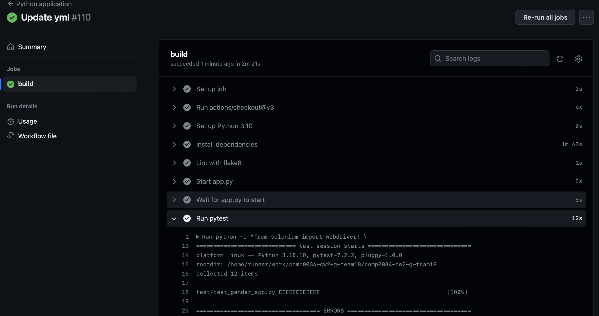

# COMP0034 Coursework 2

This repository is created for COMP0034 Coursework 2 done by Team 18. This README.md will provide introduce our 
developed REST API, which enables users to check gender pay gap data from their desired perspective. It will also talk 
about how we tested the developed app with evidence of work.

## Set-up instructions
1. URL to the GitHub repository: https://github.com/ucl-comp0035/comp0034-cw2-g-team18.git ;
2. Please install all necessary Python packages listed in [requirements.txt](requirements.txt);
3. The server when running the app is set to "127.0.0.1:9000" in [config.py](gender_app/config.py), please make sure it 
is not taken up;
4. To run the app, you can simply open [app.py](gender_app/app.py) and click 'run' on IDE such as PyCharm.
5. The CI workflow was implemented by changing some default settings of GitHub Python application. The document can be 
seen in [python-app.yml](.github/workflows/python-app.yml). Linting and dependency management can also be seen from it.

## 1. Gender Pay Gap REST API
We have developed a REST API which allows users to check relevant gender pay gap situation data that they wish to have a
 look at from their desired viewpoint (from a certain industry, region, or employer size). It also contains additional 
features and functions such as Register / Log In and showing full dataset prepared before in COMP0035. This section will 
describe what the app does with explanations in screenshots.

### 1.1 The index page
The first page when entering the app will be the index page, corresponding to [index.html](gender_app/templates/index.html) 
. When the user is not logged in, it will show command of "Please Log In!" in big size as shown below.


After logging in, it will present three categories for the user to choose, whether they wanna investigate the gender pay
 gap from industry, region, or employer size as shown in the screenshot below.


When the user select a certain category, it will show another index page, see [index_second.html](gender_app/templates/index_second.html), 
which presents all unique value under that certain category for the user to choose. For example, the following screenshot 
shows all industries in the dataset if a user chooses to investigate gender pay gap from industrial view.


### 1.2 Data page
When the user chooses which specific industry / region / employer size of companies they wanna investigate the gender 
pay gap, it will return a data table that shows mean and median of gender pay gap data. The html document for this page 
can be found at [table.html](gender_app/templates/table.html). Explanations for each data can be seen by clicking 
'About CSV data' on the [original gov.uk website](https://gender-pay-gap.service.gov.uk/viewing/download). Below is an 
example of the data table page when users click on Education following by choosing Industry.


### 1.3 Log in/out & Register
The app also includes feature of account management which allows users to create their own account and they will have to 
log in first before seeing the data. 

Here is the screenshot of login page, corresponding to [login.html](gender_app/templates/login.html). It will check whether 
the username and password match with the data stored in the database.


And here is the register page, html document can be found at [register.html](gender_app/templates/register.html). The 
registered information will be stored in [gender.db](gender_app/data/gender.db), which allows user to log in in the future. 
It has also set a series of warning when the user tries to register with existing username or enters the unmatched password 
during registration, which will be discussed in the testing part.


After logged in, the user can log out by clicking button on a navigation bar, which is configured in [navbar.html](gender_app/templates/navbar.html).


### 1.4 Display all data
The user also has access to the content of original [csv dataset](gender_app/data/gender_pay_gap_prepared.csv) 
prepared by the developer by clicking on 'Gender Pay Gap Dataset' button on the navigation bar after logging in. As the 
original dataset is quite large, it was separated into 13634 pages, where users can click to change the page. **This feature 
should be updated in the later version, which should allow users to jump into a specific page or can search/filter certain 
data.** The page is corresponding to [data_table.html](gender_app/templates/data_table.html).


## 2. Testing

In order to test the developed app, we marked the [gender_app](gender_app) directory as Sources Root and marked the 
[test](test) directory as Test Sources Root. he python file used to write testing code is named as [test_gender_app.py](test/test_gender_app.py) 
and put in a test directory. Meanwhile, a [conftest.py](test/conftest.py) is also created in the same 
directory as the testing file to include fixtures to be used during testing.

The app was tested with Selenium and Pytest. Meanwhile, other tools including coverage report and continuous integration 
are also used to test the application.

### 2.1 Fixtures
We have created two pytest fixtures in the [conftest.py](test/conftest.py).

The first one is used to set the web driver to ChromeDriver downloaded as mentioned above so that the 
driver configuration can be commonly used for every test in the testing file. Code for creating the fixture:
```ruby
@pytest.fixture
def driver():
    driver = BasePage(
        driver=webdriver.Chrome(executable_path='/comp0034-cw2-g-team18/gender_app/test/chromedriver_mac_arm64'
                                                '/chromedriver'))
    yield driver
    driver.quit()
```
The second one is named as login, which allows test code to be succinct as most features require login before testing, so 
that we don't need to write code for login procedures for all tests. Code for creating the fixture:
```ruby
@pytest.fixture
def login(driver):
    driver.get('http://127.0.0.1:9000/')
    driver.implicitly_wait(15)
    login_link = driver.find_element(By.XPATH, '//*[@id="navbarSupportedContent"]/ul/li[2]/a')
    login_link.click()
    username_input = driver.find_element(By.XPATH, '//*[@id="id_username"]')
    username_input.send_keys('admin')
    password_input = driver.find_element(By.XPATH, '//*[@id="id_password"]')
    password_input.send_keys('111')
    login_button = driver.find_element(By.XPATH, '/html/body/form/div[4]/button')
    login_button.click()
```

### 2.2 Test Functions
We have created 12 test functions with automated testing tool Selenium to test the application, which covers all routes 
created in [routes.py](gender_app/routes.py) and considers some extreme situations. Each test was described in 
'GIVEN-WHEN-THEN' approach.

#### Test Function 1: test_index_html
This test is used to test whether it shows the correct page when opening the app. To describe it in 'GIVEN-WHEN-THEN' 
approach:

    """
    GIVEN the app is not running
    WHEN the app is called to run
    THEN the index page will show text "Please Log In!"
    """

Code for this test:

```ruby
def test_index_html(driver):
    driver.get("http://127.0.0.1:9000/")
    time.sleep(5)
    h1_element = driver.find_element(By.XPATH, "/html/body/div/h1[2]")
    h1_text = h1_element.text
    assert h1_text.casefold() == "Please Log In!".casefold()
```

#### Test Function 2: test_main_function
This test is used to test the main function of the app, which is to check data based on users preference. It takes choosing 
'Industry' and 'Education' as an example.

    """
    GIVEN the app is running
    WHEN the user successfully logged in
    THEN text "Industry" will be shown on the page
    WHEN the user clicks on "Industry"
    THEN text "Education" will be shown on the page
    WHEN the user clicks on "Education"
    THEN text "Average" will be shown on the page
    """

Code for this test:
```ruby
def test_main_function(driver, login):
    time.sleep(2)
    assert (
            "Industry" in driver.find_element(By.XPATH, '/html/body/div/ul/li[1]/a').text
    )
    driver.find_element(By.XPATH, '/html/body/div/ul/li[1]/a').click()
    time.sleep(2)
    assert (
            "Education" in driver.find_element(By.XPATH, '/html/body/div/ul/li[1]/a').text
    )
    driver.find_element(By.XPATH, '/html/body/div/ul/li[1]/a').click()
    time.sleep(2)
    assert (
            "Average" in driver.find_element(By.XPATH, '/html/body/div/table/thead/tr/th[2]').text
    )
```

#### Test Function 3: test_home
This test is used to verify whether clicking on 'Home' on the navigation bar will direct the user back to the homepage (index page).

    """
    GIVEN the app is running, user successfully logged in, and user is on the data table page
    WHEN the user clicks on "Home" on the navigation bar
    THEN the app returns to the index_second page
    """

Code:
```ruby
def test_home(driver, login):
    time.sleep(2)
    driver.find_element(By.XPATH, '/html/body/div/ul/li[1]/a').click()
    time.sleep(2)
    driver.find_element(By.XPATH, '//*[@id="navbarSupportedContent"]/ul/li[1]/a').click()
    time.sleep(2)
    assert (
            "Industry" in driver.find_element(By.XPATH, '/html/body/div/ul/li[1]/a').text
    )
```

#### Test Function 4: test_unmatch_login
This function is used to test whether the system can recognize unmatched username and password.

    """
    GIVEN the user is trying to log in
    WHEN the password and username are not matched as in the database
    THEN the flash message will show "Wrong Username or Password!"
    """

Code:
```ruby
def test_unmatch_login(driver):
    driver.get('http://127.0.0.1:9000/')
    driver.implicitly_wait(15)
    login_link = driver.find_element(By.XPATH, '//*[@id="navbarSupportedContent"]/ul/li[2]/a')
    login_link.click()
    username_input = driver.find_element(By.XPATH, '//*[@id="id_username"]')
    username_input.send_keys('admin')
    password_input = driver.find_element(By.XPATH, '//*[@id="id_password"]')
    password_input.send_keys('123456')
    login_button = driver.find_element(By.XPATH, '/html/body/form/div[4]/button')
    login_button.click()
    time.sleep(2)
    assert "Wrong Username or Password!"
```

#### Test Function 5: test_logout
This function is used to check whether the user can successfully log out and return to the index page.

    """
    GIVEN the user is logged in
    WHEN the user clicks on Logout on the Navigation Bar
    THEN the user will be logged out to the index page
    """
Code for this test:
```ruby
def test_logout(driver, login):
    time.sleep(2)
    driver.find_element(By.XPATH, '//*[@id="navbarSupportedContent"]/ul/li[3]/a').click()
    time.sleep(2)
    assert (
            "Please Log In!" in driver.find_element(By.XPATH, '/html/body/div/h1[2]').text
    )
```

#### Test Function 6: test_login_to_register
This function is used to test whether the 'register' button at the login page can direct user to register page.

    """
    GIVEN the app is running and is on log in page
    WHEN the user clicks on Register button
    THEN it directs to the register page
    """

Code for this test:
```ruby
def test_login_to_register(driver):
    driver.get('http://127.0.0.1:9000/')
    driver.implicitly_wait(15)
    login_link = driver.find_element(By.XPATH, '//*[@id="navbarSupportedContent"]/ul/li[2]/a')
    login_link.click()
    register_button = driver.find_element(By.XPATH, '/html/body/form/div[4]/a')
    register_button.click()
    assert (
            "register" in driver.find_element(By.XPATH, '/html/body/form/div[1]/h5').text
    )
```

#### Test Function 7: test_edge_case
This function is used to test an edge case where the user chooses 'Employer Size' and 'Not Provided'. Since the queried 
data is not provided in the original dataset, it should return ValueError in debug mode.

    """
    GIVEN the user is logged in
    WHEN the user tries to look at data of companies which has Not Provided as Employer Size
    THEN it will raise ValueError
    """

Code for this test:
```ruby
def test_edge_case(driver, login):
    time.sleep(2)
    driver.find_element(By.XPATH, '/html/body/div/ul/li[3]/a').click()
    time.sleep(2)
    driver.find_element(By.XPATH, '/html/body/div/ul/li[5]/a').click()
    time.sleep(2)
    assert ValueError
```

#### Test Function 8: test_register
This function tests whether a successful register will direct the user to the login page. **Note: the test will automatically 
register with a username of admin.xxx where xxx represents a random integer between 0 to 1000. It will be very rare if you 
attempt testing for several times and have same username between two of them. However, possibility still exists, so this 
test may fail.**

    """
    GIVEN the user is not logged in
    WHEN the user registers with a valid username and matched password
    THEN the app directs to the login page
    """

Code for this test:
```ruby
def test_register(driver):
    driver.get('http://127.0.0.1:9000/')
    time.sleep(2)
    driver.implicitly_wait(15)
    driver.find_element(By.XPATH, '//*[@id="navbarSupportedContent"]/ul/li[3]/a').click()
    driver.find_element(By.XPATH, '//*[@id="id_username"]').send_keys('admin{}'.format(random.randint(0, 1000)))
    driver.find_element(By.XPATH, '//*[@id="id_password"]').send_keys('111')
    driver.find_element(By.XPATH, '//*[@id="id_confirm"]').send_keys('111')
    driver.find_element(By.XPATH, '/html/body/form/div[5]/button[2]').click()
    assert (
            "welcome login" in driver.find_element(By.XPATH, '/html/body/form/div[1]/h5/a').text
    )
```

#### Test Function 9: test_register_reset
This function is used to test whether the reset button at register page works.

    """
    GIVEN the user has put some strings in registration form
    WHEN the user clicks reset during registration
    THEN all inputs will be deleted
    """

Code for this test:
```ruby
def test_register_reset(driver):
    driver.get('http://127.0.0.1:9000/')
    time.sleep(2)
    driver.implicitly_wait(15)
    driver.find_element(By.XPATH, '//*[@id="navbarSupportedContent"]/ul/li[3]/a').click()
    driver.find_element(By.XPATH, '//*[@id="id_username"]').send_keys('admin{}'.format(random.randint(0, 1000)))
    driver.find_element(By.XPATH, '/html/body/form/div[5]/button[1]').click()
    assert (
            driver.find_element(By.XPATH, '//*[@id="id_username"]').get_attribute("value") == ""
    )
```

#### Test Function 10: test_unmatch_register
This function will test whether the system can detect unmatched two password inputs in the registration form.

    """
    GIVEN the user is not logged in
    WHEN the user tries to register with unmatched password
    THEN the flash message will warn "Unmatched!"
    """

Code for this test:
```ruby
def test_unmatch_register(driver):
    driver.get('http://127.0.0.1:9000/')
    time.sleep(2)
    driver.implicitly_wait(15)
    driver.find_element(By.XPATH, '//*[@id="navbarSupportedContent"]/ul/li[3]/a').click()
    driver.find_element(By.XPATH, '//*[@id="id_username"]').send_keys('admin{}'.format(random.randint(0, 100)))
    driver.find_element(By.XPATH, '//*[@id="id_password"]').send_keys('111')
    driver.find_element(By.XPATH, '//*[@id="id_confirm"]').send_keys('222')
    driver.find_element(By.XPATH, '/html/body/form/div[5]/button[2]').click()
    assert "Unmatched!"
```

#### Test Function 11: test_exist_username
This test will test whether the system recognize existing username when user wants to register with that username. It will 
use the admin username which registered before to perform the test.

    """
    GIVEN the user is not logged in
    WHEN the user wants to register with an existing username
    THEN the flash message will show "Username Exists!"
    """

Code for this test:
```ruby
def test_exist_username(driver):
    driver.get('http://127.0.0.1:9000/')
    time.sleep(2)
    driver.implicitly_wait(15)
    driver.find_element(By.XPATH, '//*[@id="navbarSupportedContent"]/ul/li[3]/a').click()
    driver.find_element(By.XPATH, '//*[@id="id_username"]').send_keys('admin')
    driver.find_element(By.XPATH, '//*[@id="id_password"]').send_keys('111')
    driver.find_element(By.XPATH, '//*[@id="id_confirm"]').send_keys('111')
    driver.find_element(By.XPATH, '/html/body/form/div[5]/button[2]').click()
    assert "Username Exists!"
```

#### Test Function 12: test_display_alldata
This function tests whether the full dataset is presented when clicking on Gender Pay Gap Data Set button on the 
navigation bar by detecting specific strings.

    """
    GIVEN the user is logged in
    WHEN the user clicks on Gender Pay Gap Data Set button on the navigation bar
    THEN it will present full dataset prepared by the developer
    """

Code for this test:
```ruby
def test_display_alldata(driver, login):
    time.sleep(2)
    driver.find_element(By.XPATH, '//*[@id="navbarSupportedContent"]/ul/li[2]/a').click()
    time.sleep(2)
    assert (
            "DiffMeanHourlyPercent" in driver.find_element(By.XPATH, '/html/body/div/div/table/thead/tr/th[1]').text
    )
    assert (
            "DiffMedianHourlyPercent" in driver.find_element(By.XPATH, '/html/body/div/div/table/thead/tr/th[2]').text
    )
```

### 2.3 Running the test
To run the test, you will first need to execute the app by clicking 'run' on your IDE to run the [app.py](gender_app/app.py) 
and please type and run

```ruby 
pytest test/test_gender_app.py
``` 

in the terminal.

The Chrome browser on the computer will be automatically opened to present the app. There will be a banner showing 
'Chrome is being controlled by automated test software.' as shown below:


***Note: it takes approximately 2 minutes to finish all tests***

You can also choose to run the test by simply clicking the 'run' button on the IDE to run the test file. Note that you 
may need to set your IDE default setting of testing to pytest. Results are shown below:

 involves developers frequently integrating their code changes into a central repository, 
followed by automated testing and building processes to verify that the code operates as intended. The aim of CI is to 
identify and resolve issues promptly, allowing developers to concentrate on writing new code and incorporating fresh 
functionalities.

Like what we did before, we have created a [workflow](.github/workflows/python-app.yml) on GitHub Actions 
based on Python Application yml file provided on GitHub. However, the default settings reports errors all the time even 
though dash app and tests went properly on IDE. Therefore, we have changed the settings with code from marketplace. The 
screenshot for a successful result is shown below:

Dependency management and linting can also be shown in this CI workflow.