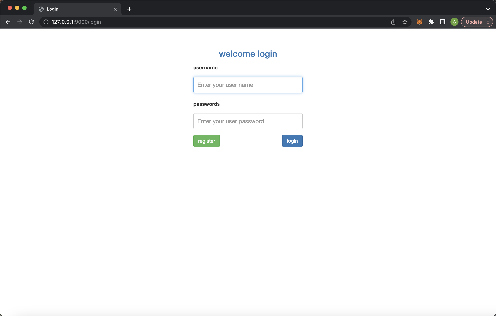

# COMP0034 Coursework 2

This repository is created for COMP0034 Coursework 2 done by Team 18. This README.md will provide introduce our 
developed REST API, which enables users to check gender pay gap data from their desired perspective. It will also talk 
about how we tested the developed app with evidence of work.

## Set-up instructions
1. URL to the GitHub repository: https://github.com/ucl-comp0035/comp0034-cw2-g-team18.git ;
2. Please install all necessary Python packages listed in [requirements.txt](requirements.txt);
3. Browser used to test the Dash created in this coursework is Chrome 109 version and our group members use Mac OS, 
the chromedriver is downloaded to [chromedriver_mac_arm64](test/chromedriver_mac_arm64) directory under [test](test) 
folder. You may need to execute it first before going to testing;
4. The server when running the app is set to "127.0.0.1:9000" in [config.py](gender_app/config.py), please make sure it 
is not taken up;
5. The CI workflow was implemented by changing some default settings of GitHub Python application. The document can be 
seen in [python-app.yml](.github/workflows/python-app.yml). Linting and dependency management can also be seen from it.

## 1. Gender Pay Gap REST API
We have developed a REST API which allows users to check relevant gender pay gap situation data that they wish to have a
 look at from their desired viewpoint (from a certain industry, region, or employer size). It also contains additional 
features and functions such as Register / Log In and showing full dataset prepared before in COMP0035. This section will 
describe what the app does with explanations in screenshots.

### 1.1 The index page
The first page when entering the app will be the index page, corresponding to [index.html](gender_app/templates/index.html) 
. When the user is not logged in, it will show command of "Please Log In!" in big size as shown below.

After logging in, it will present three categories for the user to choose, whether they wanna investigate the gender pay
 gap from industry, region, or employer size as shown in the screenshot below.

When the user select a certain category, it will show another index page, see [index_second.html](gender_app/templates/index_second.html), 
which presents all unique value under that certain category for the user to choose. For example, the following screenshot 
shows all industries in the dataset if a user chooses to investigate gender pay gap from industrial view.

### 1.2 Data page
When the user chooses which specific industry / region / employer size of companies they wanna investigate the gender 
pay gap, it will return a data table that shows mean and median of gender pay gap data. The html document for this page 
can be found at [table.html](gender_app/templates/table.html). Explanations for each data can be seen by clicking 
'About CSV data' on the [original gov.uk website](https://gender-pay-gap.service.gov.uk/viewing/download). Below is an 
example of the data table page when users click on Education following by choosing Industry.

### 1.3 Log in/out & Register
The app also includes feature of account management which allows users to create their own account and they will have to 
log in first before seeing the data. 

Here is the screenshot of login page, corresponding to [login.html](gender_app/templates/login.html).

And here is the register page, html document can be found at [register.html](gender_app/templates/register.html).

After logged in, the user can log out by clicking button on a navigation bar, which is configured in [navbar.html](gender_app/templates/navbar.html).

### 1.4 Display all data
The user also has access to the content of original [csv dataset](gender_app/data/gender_pay_gap_prepared.csv) 
prepared by the developer by clicking on 'Gender Pay Gap Dataset' button on the navigation bar after logging in. As the 
original dataset is quite large, it was separated into 13634 pages, where users can click to change the page. **This feature 
should be updated in the later version, which should allow users to jump into a specific page or can search/filter certain 
data.** The page is corresponding to [data_table.html](gender_app/templates/data_table.html).

